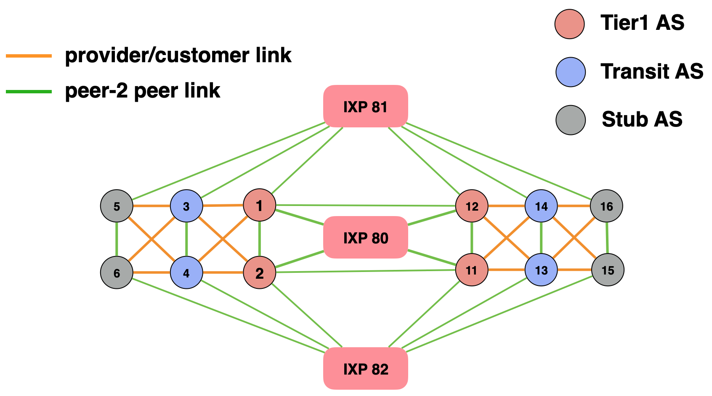

# AS-level configuration

The last configuration file describes the AS-level topology 
and contains additional parameters such as which IP prefix to use for a given inter-AS link.

The file `aslevel_links.txt` is used to build the mini-Internet whereas the file `aslevel_links_students.txt` 
is part of the mini-Internet website and contains useful information for the students, such as
with which ASes their own AS is directly connected and which IP prefix to use for inter-AS links.

## Automatic generation of the configuration files

These configuration files can be quite long (one line for every inter-AS link) and thus hard to write manually.
We thus provide a script called [generate_connections.py](https://github.com/nsg-ethz/mini_internet_project/blob/master/platform/utils/build_configs/generate_connections.py) that automatically generates these two configuration files.
You can run the script with the following command:

```
python3 generate_connections.py
```

Once generated by our script, just copy the resulting config files (`AS_config.txt`, `aslevel_links.txt` and `aslevel_links_students.txt`) into the `config` directory.

:information_source: This script also generates the [`AS_config.txt`](general_configuration#as_configtxt) file which was introduced before. With this script though, RPKI will not be enabled by default, you will have to manually update the configuration file.

The pattern of the AS-level topology is however hard coded in the script (different regions interconnected with IXPs, etc).
We provide different sizes of the topology, thus you can easily generate a 12-ASes topology or 70-ASes topology (use the `NB_ASES` variable in the source code to change the size).

As an illustration, the following image shows a 12-ASes topology, which is also the default topology (it's a rather small topology, which is good to start).

<p align="center">

</p>


:warning: The names of the routers are also hard coded in the script. Thus if you use another layer-3 topology, you will need to update the script.

If you want to use your own AS-level topology that exhibits a different pattern than the one we use, 
you will have to create the corresponding config files, either manually or by using a custom script.

## [`aslevel_links.txt`](https://github.com/nsg-ethz/mini_internet_project/tree/master/platform/config/aslevel_links.txt)

We now show and explain the content of this configuration file for a 12-ASes topology, generated using our `generate_connections.py` script. Each line corresponds to an inter-AS link.

```
C1   C2       C3      C4     C5       C6          C7     C8         C9
---------------------------------------------------------------------------------
1   ZURI	Peer	  12    ZURI	Peer        100000	1000	179.0.1.0/24
1   ZURI	Provider  3     BASE	Customer    100000	1000	179.0.2.0/24
1   ZURI	Provider  4     MUNI	Customer    100000	1000	179.0.3.0/24
1   ZURI	Peer	  80    None	Peer        100000	1000	1,2,11,12
1   BASE	Peer	  81    None	Peer        100000	1000	11,12,13,14,15,16
1   ZURI	Peer	  2     ZURI	Peer        100000	1000	179.0.4.0/24
2   ZURI	Provider  4     BASE	Customer    100000	1000	179.0.5.0/24
2   ZURI	Provider  3     MUNI	Customer    100000	1000	179.0.6.0/24
2   ZURI	Peer	  80    None	Peer        100000	1000	1,2,11,12
2   BASE	Peer	  82    None	Peer        100000	1000	11,12,13,14,15,16
11  ZURI	Peer 	  2     ZURI	Peer        100000	1000	179.0.7.0/24
11  ZURI	Provider  13    BASE	Customer    100000	1000	179.0.8.0/24
11  ZURI	Provider  14    MUNI	Customer    100000	1000	179.0.9.0/24
11  ZURI	Peer	  80    None	Peer        100000	1000	1,2,11,12
11  BASE	Peer	  82    None	Peer        100000	1000	1,2,3,4,5,6
11  ZURI	Peer	  12    ZURI	Peer        100000	1000	179.0.10.0/24
12  ZURI	Provider  14    BASE	Customer    100000	1000	179.0.11.0/24
12  ZURI	Provider  13    MUNI	Customer    100000	1000	179.0.12.0/24
12  ZURI	Peer	  80    None	Peer        100000	1000	1,2,11,12
12  BASE	Peer	  81    None	Peer        100000	1000	1,2,3,4,5,6
3   LYON	Provider  5     ZURI	Customer    100000	1000	179.0.13.0/24
3   MILA	Provider  6     ZURI	Customer    100000	1000	179.0.14.0/24
3   LUGA	Peer	  4     LUGA	Peer        100000	1000	179.0.15.0/24
3   VIEN	Peer	  81    None	Peer        100000	1000	11,12,13,14,15,16
4   LYON	Provider  6     ZURI	Customer    100000	1000	179.0.16.0/24
4   MILA	Provider  5     ZURI	Customer    100000	1000	179.0.17.0/24
4   VIEN	Peer	  82    None	Peer        100000	1000	11,12,13,14,15,16
13  LYON	Provider  15    ZURI	Customer    100000	1000	179.0.18.0/24
13  MILA	Provider  16    ZURI	Customer    100000	1000	179.0.19.0/24
13  LUGA	Peer	  14    LUGA	Peer        100000	1000	179.0.20.0/24
13  VIEN	Peer	  82    None	Peer        100000	1000	1,2,3,4,5,6
14  LYON	Provider  16    ZURI	Customer    100000	1000	179.0.21.0/24
14  MILA	Provider  15    ZURI	Customer    100000	1000	179.0.22.0/24
14  VIEN	Peer	  81    None	Peer	    100000	1000	1,2,3,4,5,6
5   ZURI	Peer 	  6     ZURI	Peer	    100000	1000	179.0.23.0/24
5   BASE	Peer	  81    None	Peer	    100000	1000	11,12,13,14,15,16
6   BASE	Peer	  82    None	Peer	    100000	1000	11,12,13,14,15,16
15  ZURI	Peer	  16    ZURI	Peer	    100000	1000	179.0.24.0/24
15  BASE	Peer	  82    None	Peer	    100000	1000	1,2,3,4,5,6
16  BASE	Peer	  81    None	Peer	    100000	1000	1,2,3,4,5,6
```

Below is the description of each column:

* **C1:** AS number of the AS at one end of the link.
* **C2:** Router within the AS in C1 that is connected to the other AS.
* **C3:** With which type of business relationship the AS in C1 is connected to the neighboring AS in C4. For instance, the second line indicates that AS1 is a provider of AS4, and AS4 a customer of AS1.
* **C4:** Same as C1 but for the other end of the link.
* **C5:** Same as C2 but for the other end of the link.
* **C6:** Same as C3 but for the other end of the link.
* **C7:** The throughput of the link.
* **C8:** The delay of the link.
* **C9:** Two possible cases:
    - When its an AS-to-AS link: IP prefix to use for the eBGP sessions.
    - When its an AS-to-IXP link: with which participants of the IXP the AS should peer with (comma-separated list of AS numbers).

To illustrate, the second line indicates that `ZURI` in AS1 is connected to `BASE` in AS3, and AS1 is the provider of AS3.

To reduce the server load, an IXP AS contains only one router. Therefore, C5 is `None` when there is an IXP.

C9 is used to autoconfigure the different networks and achieve network-wide connectivity when using the `Config` flag in the `AS_config.txt` configuration file. 

## [`aslevel_links_students.txt`](https://github.com/nsg-ethz/mini_internet_project/tree/master/platform/config/aslevel_links_students.txt)

We show and explain the content of the `aslevel_links_students.txt` configuration file for a 12-ASes topology and when generated using the `generate_connections.py` script.
Below is a snippet of this configuration file.

``` 
C1   C2      C3       C4     C5      C6             C7
1   ZURI    Peer      12    ZURI    Peer        179.0.1.1/24
12  ZURI    Peer      1     ZURI    Peer        179.0.1.2/24
1   ZURI    Provider  3     BASE    Customer    179.0.2.1/24
3   BASE    Customer  1     ZURI    Provider    179.0.2.2/24
1   ZURI    Provider  4     MUNI    Customer    179.0.3.1/24
4   MUNI    Customer  1     ZURI    Provider    179.0.3.2/24
1   ZURI    Peer      80    None    Peer        180.80.0.1/24
80  None    Peer      1     ZURI    Peer        180.80.0.80/24
1   BASE    Peer      81    None    Peer        180.81.0.1/24
81  None    Peer      1     BASE    Peer        180.81.0.81/24
1   ZURI    Peer      2     ZURI    Peer        179.0.4.1/24
2   ZURI    Peer      1     ZURI    Peer        179.0.4.2/24
2   ZURI    Provider  4     BASE    Customer    179.0.5.1/24
```

Below is the description of each column:

* **C1:** AS number of the AS at one end of the link.
* **C2:** Router within the AS in C1 that is connected to the other AS.
* **C3:** With which type of business relationship the AS in C1 is connected to the neighboring AS in C4. For instance, the third line indicates that AS1 is a customer of AS3, and AS3 a provider of AS1.
* **C4:** Same as C1 but for the other end of the link.
* **C5:** Same as C2 but for the other end of the link.
* **C6:** Same as C3 but for the other end of the link.
* **C7:** IP address which is shown on the mini-Internet website to tell students which IP address they should use for their eBGP connections.

The content of this file is used to generate the "AS connections" file on the mini-Internet website. Student can use this file to figure out which IPs/prefixes they should use for their eBGP sessions towards their neighbors. In case you want to let the students decide on which IP address to use, you can e.g., replace the last byte of the IP address in C7 by `X`. For example: `179.0.1.X/24`.

> You can modify the content of this file at runtime: the website will automatically show the newest version.
