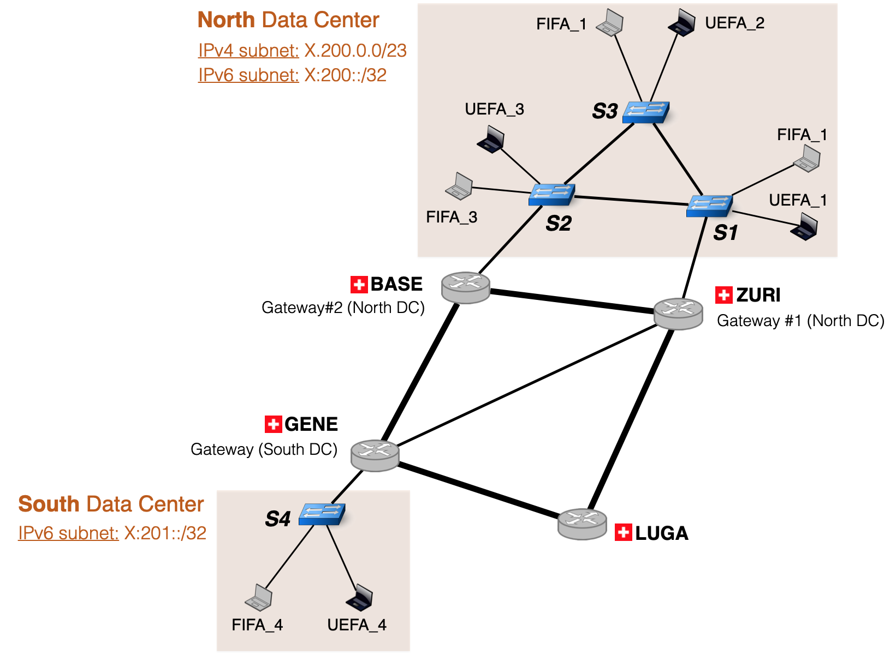

# Layer-2 configuration

You can define one or more layer-2 networks inside every AS.
You can do this through three configuration files that describe these layer-2 networks.
These configuration files are applied on one or more ASes, according to the `AS_config.txt` file.
In the following, we explain each configuration file and give an example.

The default configuration files depicted below build the following L2 network:

<p align="center">

</p>

:information_source: In case you do not want to have a layer-2 network in your mini-Internet, 
just make the following configuration files empty.

## [`l2_switches.txt`](https://github.com/nsg-ethz/mini_internet_project/tree/master/platform/config/l2_switches.txt)

This file lists the switches in the layer-2 networks included in an AS.
The following table shows an example of this configuration file. 

```
C1     C2     C3           C4          C5
------------------------------------------
DCN    S1    ZURI   11:11:11:11:11:11   1
DCN    S2    BASE   22:22:22:22:22:22   2
DCN    S3    N/A    33:33:33:33:33:33   3
DCS    S4    GENE   44:44:44:44:44:44   4
```

Below is the description of each column:

* **C1:** Name of the layer-2 network the switch belongs to. Here DCN (resp. DCS) means Data Center North (resp. South). 
* **C2:** Name of the layer-2 switch.
* **C3:** Router to which the layer-2 switch is connected to (or N/A if the switch is not connected to a router).
* **C4:** The MAC address to use for a switch which will serve as an `ID`.
* **C5:** The bridge ID for the switch which is used for the spanning tree computation.

Note that a router can only be connected to one L2 network, but a layer 2 network can be connected to one or more routers.

:information_source: When a switch is connected to a router, it must also be indicated in the third column of the `l3_router.txt` configuration file,
which lists the L3 routers. In the `l3_router.txt` configuration file, the name of the L2 network must always be preceded by `L2-`.

## [`l2_hosts.txt`](https://github.com/nsg-ethz/mini_internet_project/tree/master/platform/config/l2_hosts.txt)


This file lists the hosts that are in the layer 2 network along with their parameters.
The following table shows an example of such a configuration file. 

```
C1                   C2         C3    C4     C5      C6     C7
---------------------------------------------------------------
FIFA_1   miniinterneteth/d_host DCN   S1    10000   1000    10
UEFA_1   miniinterneteth/d_host DCN   S1    10000   1000    20
vpn_1    miniinterneteth/d_host DCN   S1    10000   1000    30
FIFA_2   miniinterneteth/d_host DCN   S2    10000   1000    10
UEFA_2   miniinterneteth/d_host DCN   S2    10000   1000    20
vpn_2    miniinterneteth/d_host DCN   S2    10000   1000    30
FIFA_3   miniinterneteth/d_host	DCN   S3    10000   1000    10
UEFA_3   miniinterneteth/d_host DCN   S3    10000   1000    20
vpn_3    miniinterneteth/d_host DCN   S3    10000   1000    30
FIFA_4   miniinterneteth/d_host DCS   S4    10000   1000    10
UEFA_4   miniinterneteth/d_host DCS   S4    10000   1000    20
```

Below is the description of each column:

* **C1:** Name of the host.
* **C2:** Docker image to use for this host.
* **C3:** The name of the L2 network the host belongs to.
* **C4:** The name of the switch to which the host is connected.
* **C5:** The throughput of the link between the host and the switch (in Kbps).
* **C6:** The delay of the link between the host and the switch (in ms).
* **C7:** The VLAN to which the host belongs to.

:information_source: Observe that a host can be a VPN server, in which case its name must start with `vpn_`.
In the example above, there are three VPNs (`vpn_1`, `vpn_2` and `vpn_3`), all in `DCN`.

## [`l2_links.txt`](https://github.com/nsg-ethz/mini_internet_project/tree/master/platform/config/l2_links.txt)

The last file describes the layer-2 topologies. Each line corresponds to a link between two switches.  
The following table shows an example of such a configuration file.


```
C1    C2    C3   C4     C5     C6
------------------------------------------
DCN   S1   DCN   S2   10000   1000
DCN   S1   DCN   S3   10000   1000
DCN   S2   DCN   S3   10000   1000
```

Below is the description of each column:


* **C1:** Name of the L2 network where the first switch of the link is located.
* **C2:** The name of the first switch of the link.
* **C3:** Name of the L2 network where the second switch of the link is located.
* **C4:** The name of the second switch of the link.
* **C5:** The throughput of the link between the host and the switch (in Kbps).
* **C6:** The delay of the link between the host and the switch (in ms).

:information_source: The names of the layer-2 networks should be identical for the two switches
since it is not possible to connect two switches that are in two different L2 networks.
