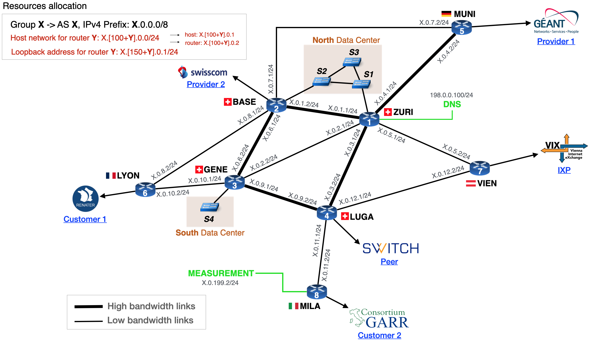

# Layer-3 configuration

The files `l3_routers.txt` and `l3_links.txt` describe the layer-3 topology. 
Besides the topology, additional parameters are set to different routers.
We describe these two configuration files and their parameters in the following sections.

The default configuration files shown below build the following L3 network:

<p align="center">

</p>

## [`l3_routers.txt`](https://github.com/nsg-ethz/mini_internet_project/tree/master/platform/config/l3_routers.txt)

This file contains all the routers in the layer-3 topology.
The following table shows an example of this configuration file. 

```
 C1     C2                         C3                          C4
-------------------------------------------------------------------
ZURI	DNS           L2-DCN:miniinterneteth/d_host           linux
BASE	N/A           L2-DCN:miniinterneteth/d_host           vtysh
GENE	N/A           L2-DCS:miniinterneteth/d_host           linux
LUGA	N/A           routinator:miniinterneteth/d_routinator vtysh
MUNI	N/A           host:miniinterneteth/d_host             vtysh
LYON	MATRIX        host:miniinterneteth/d_host             vtysh
VIEN	MATRIX_TARGET host:miniinterneteth/d_host             vtysh
MILA	MEASUREMENT   host:miniinterneteth/d_host             vtysh
```

Below is the description of each column:

* **C1:** Name of the router.
* **C2:** Service associated to the router. Only one service can be associated to a given router. The different options are listed below.
* **C3:** Information about the host or layer-2 network connected to the corresponding router. The different options are listed below.
* **C4:** Indicate wether the students can access the router container with bash or can only access the CLI, see below.

**Possible services in C2:**
- _MATRIX_: where the pings used for the connectivity matrix are sent to.
- _MATRIX_TARGET_: the destination of the pings used for the connectivity matrix.
- _DNS_: to which router the DNS container is connected to.
- _MEASUREMENT_: to which router the MEASUREMENT container is connected to.
- _N/A_: no special service.

**Possible options in C3:**\
The C3 consists of two values separated by a colon. Before the colon you can specify the following options:

- _host_: a single host is connected to the router.
- _L2-X_: the router is connected to the L2-network X. Besides the L2-network, there will also be a single host directly connected to the router.
- _routinator_: a host running routinator (for RPKI) is connected to the router.
- _krill_: a host running Krill (for RPKI) is connected to the router.

_After_ the colon, you must indicate the docker image to use for the host that is connected to the router.
You can thus plug-in any docker images you want for hosts in the mini-Internet (e.g., an image with a webserver or a VLC client).

**vtysh or linux in C4:**\
`vtysh` means the students can only access the CLI of the router
whereas anything else means the students can access the router container using bash
(via the `goto.sh` script, using the keyword `container` instead of `router`).
This is used to answer questions that require linux commands (such as configuring 6in4 tunnels).


## [`l3_links.txt`](https://github.com/nsg-ethz/mini_internet_project/tree/master/platform/config/l3_links.txt)

This file lists all the links in the layer-3 topology.
The following table shows an example of this configuration file. 

```
 C1      C2       C3    C4
---------------------------
ZURI	BASE	100000	20
ZURI	GENE	100000	20
ZURI    LUGA    100000	20
ZURI	MUNI    10000 	100
ZURI    VIEN    10000	100
BASE    GENE    100000	20
BASE    MUNI    10000 	100
BASE    LYON    10000 	100
GENE    LUGA    100000 	20
GENE    LYON    10000   100
LUGA    MILA    10000   100
LUGA    VIEN    10000   100
```

Below is the description of each column:

* **C1:** Name of the router at one end of the link. 
* **C2:** Name of the router at the other end of the link.
* **C3:** The throughput of the link (in Kbps).
* **C4:** The delay of the link (in ms).
